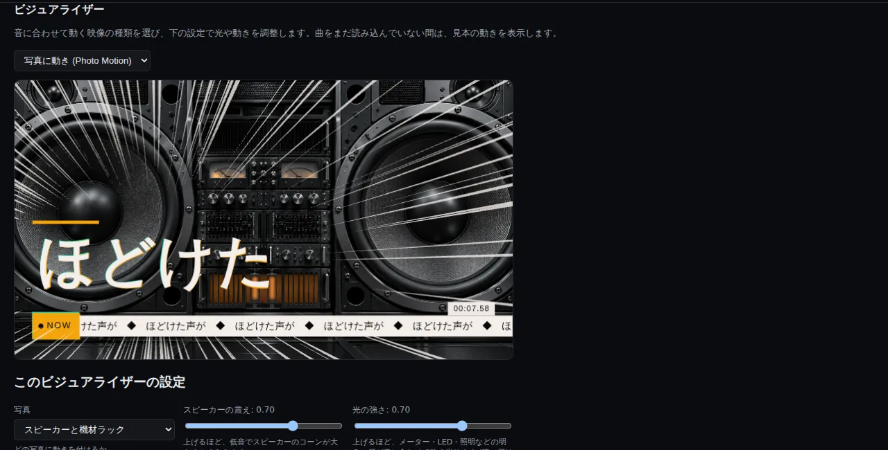

# ZUNZUN3

曲を読み込んで、**音に反応する映像（ビジュアライザー）と歌詞の動き（リリックモーション）** を作り、MP4 に書き出せる、ブラウザだけで動くツールです。
**曲・歌詞・画像は外部に送信しません**（すべてこのブラウザの中だけで処理します。外に出る通信は、歌詞の書体を Google Fonts から読み込むときだけです）。

- 使ってみる: https://luarietakamiya-dotcom.github.io/ZUNZUN/
- 設計: [docs/ARCHITECTURE.md](docs/ARCHITECTURE.md)　/　開発の現在地・引き継ぎ: [docs/HANDOFF.md](docs/HANDOFF.md)



## できること

- **ビジュアライザー**: 曲の低音・中音・高音・拍・スペクトルに反応する映像を、種類を選ぶだけで出せます。
  Solar Gate / Milky Way / Live Stage / Speaker Rack / Speaker Cone / Twin Speakers / Mega Speaker / Edge Equalizer / Spectrum Wave /
  LED Matrix / Ripples / **Kaleidoscope（万華鏡）** / Photo Motion / City Scroll / Cyber Space。何も出さない「なし」もあります。
  - 万華鏡は、曲全体の曲調と区間（歌詞の `[サビ]` などの見出し、なければ音の変化）に合わせて、色・模様・光る輪郭（ときどきハートになります）が変わります。
- **リリックモーション**: 歌詞を貼って、曲に合わせてタップ（またはタイムラインで調整）すると、文字が動きます。スタイル・動きの強さ・区間ごとの強弱を選べます。
- **背景と素材**: 背景に画像・動画・スライドショー（フォルダ名や見出しで区間ごとの画像）を置けます。グリーンバック素材の切り抜き、重ねる画像にも対応しています。
- **画面の大きさ**: 上のメニューで、16:9 / 9:16 / 1:1 / 2:3 / 3:2 / 4:5 / 3:4 / 4:3 / 21:9 から選べます。プレビューも書き出しも、その大きさになります。
- **書き出し**: MP4（H.264 + AAC）。曲の長さ・画面の大きさ・コマ数（30 / 60 fps）・画質を選べます。同じプロジェクトなら、同じ映像が出ます。
- **保存**: 設定は `*.zunzun.json` として保存できます（曲・画像そのものは入れず、名前と照合用の値だけ。開くときに選び直します）。
- **日本語 / English**、PC 表示 / スマホ表示。

## 使い方（流れ）

1. 「音楽」タブで曲を読み込む。
2. 「ビジュアライザー」タブで種類を選び、設定を調整する（上のメニューで画面の大きさも選ぶ）。
3. 歌詞を動かすなら「歌詞」タブで歌詞を入れてタップし、「リリックモーション」タブでスタイルを選ぶ。
4. 「背景と素材」タブで背景などを置く。
5. 「書き出し」タブで、コマ数と画質を選んで書き出す（保存先を聞かれます）。

詳しくは、アプリの「使い方」タブを見てください。

## 動作環境

- **PC の最新の Chrome / Edge**（Chromium 系）を想定しています。MP4 の書き出しには、ブラウザの WebCodecs が必要です。
  WebCodecs が無いブラウザでは、書き出しの画面に案内が出て、書き出しだけができません。
- WebGL2 が使えること。
- スマホでも動きますが、書き出しは動画を最後までメモリに置くため、長い曲・大きい画面・高画質では止まることがあります
  （書き出しの画面に、ファイルの大きさの目安と注意が出ます）。

## 光過敏への配慮

映像は、広い範囲が急に明るくなる変化を毎秒 3 回までにするよう作っています（自動テストで全ビジュアライザーを測っています。正式な検査の代わりではありません）。
光に敏感な方は、「明るさ」「動き」の設定を下げてお使いください。

## 不具合・要望

不具合の報告や要望は、GitHub の [Issues](https://github.com/luarietakamiya-dotcom/ZUNZUN/issues) へお願いします（使ったブラウザ、画面の大きさ、曲の長さが分かると助かります。曲や歌詞のファイルそのものは貼らないでください）。

## 開発

```bash
npm install
npm run dev        # http://localhost:5173
npm run build      # 型チェック + ビルド
npm run lint
npm test           # 単体テスト (Vitest)
npm run test:e2e   # E2E (Playwright)
```

TypeScript + Vite + three.js + WebCodecs / Mediabunny。プリセットは `src/visualizers/<id>/` に閉じていて、追加は `src/visualizers/index.ts` に 2 行足すだけです。

## ライセンス・画像・権利

- ソースコードは MIT License（[LICENSE](LICENSE)）。中で使っているもののライセンスは [THIRD_PARTY_NOTICES.md](THIRD_PARTY_NOTICES.md)（アプリの「使い方」タブにも載せています）。
- 同梱の画像（街並み・サイバー空間・用意された背景・写真に動き）は、作者が ChatGPT（OpenAI の画像生成）で作ったもので、**MIT ライセンスの対象外**です。
  いまの取り決め（仮。正式公開までに見直します）: これらの画像を使って作った映像は、公開・配信してかまいません（クレジット不要）。画像ファイルそのものの再配布や、別の製品への利用は許可していません。
- 生成した映像の権利は、使用した曲・画像の権利者の許諾範囲に従います。
